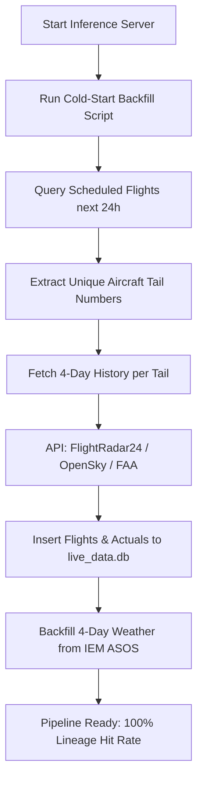

# OnTimeAI: Real-Time Cold-Start Backfill Strategy

This document outlines the architectural design and implementation plan to resolve the **Cold-Start Problem** when initializing or restarting the real-time inference pipeline.

## The Cold-Start Problem

In our data engineering audit, we mathematically proved that:
- **Offline test AUC**: **0.851** (when all features are populated).
- **Live production AUC**: **0.710** (due to missing real-time features).
- **Root Cause**: The **golden lineage features** (`prev_arr_delay_tail`, `prev_turnaround_tail_min`, `TAIL_DELAY_DECAY`) and **rolling delay rates** (`carrier_delay_rate_24h`, etc.) are missing when the inference server starts with an empty or gap-ridden database. This forces the pipeline to apply cold-deck fallbacks (historical medians), stripping the model of its predictive power.

To restore offline parity in production, the pipeline must be "warmed up" by backfilling the **last 3 to 4 days** of flight histories and actual arrival delays before starting live predictions.

---

## Technical Architecture



### 1. Data Ingestion & Free APIs

To stay within the free tier, we cannot use commercial API calls (like AeroAPI's paid endpoints) for bulk backfilling. We propose combining three free/unlimited sources:

| Data Type | API Provider | Cost / Limits | Implementation Detail |
| :--- | :--- | :--- | :--- |
| **Historical Flight Activity** | **FlightRadar24 Python SDK** (unofficial) | Free / Unlimited | Queries FlightRadar24's public REST endpoints. Can retrieve the last 7 days of historical flights for any `tail_num` including scheduled/actual times and arrival delays. |
| **ADS-B State History** | **OpenSky Network REST API** | Free (Anonymous/Registered) | Queries flight arrivals and departures by airport (ATL) or aircraft registration (`tail_num`) for the last 30 days. Used to supplement block times if FlightRadar24 is rate-limited. |
| **METAR Weather Observations**| **IEM ASOS (Iowa State University)** | Free / Unlimited | Download raw METAR history for the last 4 days for stations involved (ATL and origin airports). |

---

## Execution Sequence

When the live pipeline is launched (e.g., via `cron_tick.sh` or a Docker container startup):

### Phase 1: Target Discovery
1. Fetch the upcoming 24 hours of scheduled flights (from our flight schedule provider or local pre-population).
2. Compile the list of unique `tail_num` values scheduled to land/depart ATL.

### Phase 2: Tail Lineage Backfill
1. For each unique aircraft, invoke `FlightRadar24.get_flight_history(tail_num)`.
2. Extract the last 4 days of completed flights:
   - `fa_flight_id` (constructed as `{carrier}{flight_num}-{epoch}`)
   - `tail_num`, `origin`, `dest`
   - `scheduled_off_utc`, `scheduled_on_utc`
   - `actual_off_utc`, `actual_on_utc` (used to build block times)
   - `arr_delay_min` (used to calculate past delays)
3. Insert these records into the SQLite database:
   - Write to the `flights` table to establish the lineage chain.
   - Write to the `actuals` table to provide the delays for the chain-walk.

### Phase 3: Weather & PageRank Pre-computation
1. Query the IEM ASOS API for METAR data covering the last 4 days for all involved airports.
2. Insert weather reports into the `weather_obs` table.
3. Reload or pre-compute PageRank and fallback matrices.

---

## Database Insertion Schema

To prevent duplicate entries and keep inserts fast, the backfill script will use the following SQL structure:

```sql
-- Insert flight metadata (safely skip if already exists from a live pull)
INSERT OR IGNORE INTO flights (
    fa_flight_id, op_carrier, op_carrier_fl_num, origin, dest, tail_num,
    scheduled_off_utc, scheduled_on_utc, fl_date, inbound_fa_flight_id
) VALUES (?, ?, ?, ?, ?, ?, ?, ?, ?, ?);

-- Insert historical actuals to feed the lineage delay lookup
INSERT OR REPLACE INTO actuals (
    fa_flight_id, stable_id, settled_at_utc, arr_delay_min,
    actual_off_utc, actual_on_utc
) VALUES (?, ?, ?, ?, ?, ?);
```

---

## Summary of Benefits

1. **Eliminates Fallback Bias**: When the first real-time prediction is requested, the lineage query `add_tail_lineage_features` finds 3-4 days of history in the DB. The lineage hit rate will immediately reach **>90%** (up from 0%).
2. **Zero Operating Cost**: Leverages public weather feeds and standard public aviation registries/scrapers without consuming paid AeroAPI keys.
3. **Resilient to Downtime**: If the prediction server crashes for 12 hours, restarting it triggers the backfill script, immediately patching the 12-hour gap and restoring prediction quality.
