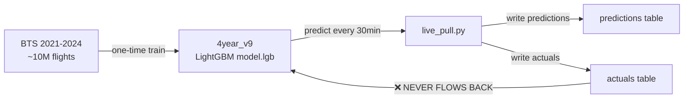

# Model Drift Investigation — OnTimeAI Live Predictions

**Date**: 2026-06-06  
**Context**: 7+ days of live predictions, observed AUC gap ~0.718 live vs ~0.847 test  
**Local DB**: `live_data.db` with 45,741 predictions and 65,874 actuals

---

## Executive Summary

The model drift has **three root causes**, in order of impact:

| # | Root Cause | Impact | Severity |
|---|---|---|---|
| **1** | **No online learning / back-feeding** — the model is frozen at training time | Probabilities drift as live distribution diverges from training data | 🔴 Critical |
| **2** | **52% of predictions are made post-takeoff** — especially ATL arrivals | Pollutes metrics and predicts flights that already have known outcomes | 🔴 Critical |
| **3** | **Recalibration is manual-only** — never runs automatically | Calibration layer degrades over time without periodic refresh | 🟡 Major |

---

## Finding 1: The Model Does NOT Back-Feed Live Data

> [!CAUTION]
> The LightGBM booster (`4year_v9`) is a **static artifact** trained on BTS data 2021–2024. Live actuals are **never used to update the model weights**.

### How the pipeline actually works:



### What exists vs what's missing:

| Component | Status | Path |
|---|---|---|
| **Training** | ✅ One-time, static | [train.py](file:///Users/mateopappalardo/FACU/TEsis/OnTimeAI-Backend/train.py) |
| **Live prediction** | ✅ Runs every 30min | [live_pull.py](file:///Users/mateopappalardo/FACU/TEsis/OnTimeAI-Backend/live_pull.py) |
| **Actuals collection** | ✅ Runs every tick | [live_pull.py:200-233](file:///Users/mateopappalardo/FACU/TEsis/OnTimeAI-Backend/live_pull.py#L200-L233) |
| **Recalibration** | ⚠️ Manual only | [recalibrate_live.py](file:///Users/mateopappalardo/FACU/TEsis/OnTimeAI-Backend/recalibrate_live.py) |
| **Online learning / retrain** | ❌ Does not exist | — |
| **Automated recalibration** | ❌ Not in cron | [cron_tick.sh](file:///Users/mateopappalardo/FACU/TEsis/OnTimeAI-Backend/scripts/cron_tick.sh) only runs `live_pull.py` |

### The recalibration script ([recalibrate_live.py](file:///Users/mateopappalardo/FACU/TEsis/OnTimeAI-Backend/recalibrate_live.py)):

- Fits an **IsotonicRegression** (or sigmoid/Platt scaling) on live actuals
- Creates a `StackedCalibrator` wrapping the original calibrator + the live-fit one
- **But it only adjusts probability calibration — it does NOT update model weights**
- **It's never called automatically** — `cron_tick.sh` only invokes `live_pull.py`
- Last recalibration: `v9_recal` at `2026-05-16 18:45` — **rolled back the next day** due to isotonic overfitting

> [!IMPORTANT]
> The model is essentially frozen at its training state from May 2026. It has 12K+ actuals available but none are used to update the booster.

### Why this causes drift:

The model was trained on **full-US BTS data** (all airports, all routes). Live inference is **ATL-only**. This creates a **domain shift**:
- Training distribution: uniform across US airports, multi-year seasonal patterns
- Live distribution: single hub (ATL), current weather/season only, different airline mix
- The model's internal feature importances are calibrated for the average US flight, not ATL-specific patterns

Without online adaptation, the model's probability estimates slowly diverge from ATL-specific base rates.

---

## Finding 2: 52% of Predictions Are Made Post-Takeoff

> [!WARNING]
> **23,652 out of 45,741 predictions (52%) were generated AFTER the flight had already physically departed.** This is the single biggest quality issue.

### Data evidence:

| Category | Count | Avg Proba | Avg Actual Delay |
|---|---|---|---|
| `ARR_TO_ATL` post-takeoff | **16,809** | 0.099 | +1.6 min |
| `DEP_FROM_ATL` post-takeoff | 2,713 | 0.061 | −11.9 min |
| `OTHER` post-takeoff | 4,130 | 0.271 | +7.6 min |
| Pre-takeoff (all) | 9,329 | 0.120 | — |

### Root cause in code:

The target query in [live_pull.py:331-350](file:///Users/mateopappalardo/FACU/TEsis/OnTimeAI-Backend/live_pull.py#L331-L350) has a critical design flaw:

```python
# Step 1: Query standing departures from ATL (with actual_off filter ✅)
db_dep_rows = conn.execute("""
    SELECT f.fa_flight_id
    FROM flights f
    LEFT JOIN actuals a ON a.fa_flight_id = f.fa_flight_id
    WHERE f.origin = 'ATL'                          -- ← ONLY departures
      AND a.actual_off_utc IS NULL                  -- ← Good: excludes already-departed
      AND datetime(COALESCE(...)) > datetime(?)     -- ← Good: still in the future
""")

# Step 2: Union with freshly fetched arrivals (NO actual_off filter ❌)
target_ids = list(
    {r[0] for r in db_dep_rows}
    | {r["fa_flight_id"] for r in sched_rows + arr_sched_rows}  # ← ARRIVALS BYPASS!
)
```

**The `actual_off_utc IS NULL` filter only applies to departures (origin='ATL').**  
Arrivals to ATL (`arr_sched_rows`) are unioned in **without any departure status check**.

Since ATL arrivals originate from other airports, by the time the `scheduled_arrivals` API returns them in the schedule window, many have already departed from their origin. The system generates predictions for flights that are literally mid-air, or worse, already landed at their destination.

### Product perspective:

> [!IMPORTANT]
> **Should we predict post-takeoff?**  
> 
> It depends on the use case:
> - **For airport operations (ground crew planning)**: Yes, mid-flight predictions have value — "this plane is in the air and will arrive 20min late" helps gate planning
> - **For passengers/airline pre-departure decisions**: No, a prediction after takeoff is useless for rebooking decisions
> - **For model accuracy metrics**: Post-takeoff predictions **should be labeled differently** — they have access to departure delay info (actual_off) that pre-departure predictions don't have, making metric comparison invalid
>
> Currently, post-takeoff predictions are mixed into the same metrics pool as pre-departure ones, which **inflates sample count but dilutes meaningful accuracy measurement**.

---

## Finding 3: Recalibration Is Manual and Has Never Successfully Run in Production

### Timeline:

| Date | Event |
|---|---|
| 2026-05-15 | `4year_v9` deployed (base model, no live calibration) |
| 2026-05-16 | `v9_recal` deployed with isotonic calibration on ~2,266 actuals |
| 2026-05-17 | `v9_recal` **rolled back** due to isotonic overfitting — destroying AUC |
| 2026-05-17+ | Running on raw `v9` (no recalibration) — still active as of 2026-05-27 |
| 2026-05-27 | Last prediction recorded (local DB), 12K+ actuals available |

The `recalibrate_live.py` script:
- Was last successfully applied once, then **immediately rolled back**
- Uses `fit_calibrator(method="sigmoid")` now (Platt scaling, 2 params, safer than isotonic)
- But it was **never re-run** after the rollback
- Is **not part of any automated pipeline** (not in `cron_tick.sh`, not in Cloud Run scheduler)

### Impact:

Without periodic recalibration, the probability outputs from the model are not adjusted for the live ATL-specific base rate. The model predicts based on full-US training distribution probabilities, which don't match ATL's actual delay rate.

---

## Supplementary Findings

### 4. Feature NaN Rates Are Still Elevated

The `FIXES_PLAN.md` documents the known NaN issues:
- `prev_arr_delay_tail`: historically 59.6% NaN (run 856)
- Fixes A (re-enable fallback), B (cross-source reconciliation), C (chain-walk prioritization) were **designed but status unclear**
- The lineage fallback is now default-on ([live_pull.py:380](file:///Users/mateopappalardo/FACU/TEsis/OnTimeAI-Backend/live_pull.py#L380)), but cross-source reconciliation and chain-walk prioritization need verification

### 5. Data Currency Gap

The local `live_data.db` copy has:
- Last prediction: `2026-05-27T14:35:27 UTC`
- Last actual: `2026-05-27T14:47:37 UTC`
- This is **10 days stale** from today (2026-06-06)

The production Cloud Run job likely has newer data in GCS, but the local DB hasn't been synced.

### 6. Metric Contamination from Post-Takeoff Predictions

The [eval_live.py](file:///Users/mateopappalardo/FACU/TEsis/OnTimeAI-Backend/eval_live.py) script does NOT filter out post-takeoff predictions when computing AUC:

```python
# eval_live.py:54-76 — joins predictions to actuals with NO departure-timing filter
df = pd.read_sql("""
    SELECT p.fa_flight_id, p.proba_delay, ...
    FROM predictions p
    JOIN actuals a ON p.fa_flight_id = a.fa_flight_id
    WHERE a.arr_delay_min IS NOT NULL
      AND a.cancelled = 0
""", con)
```

This means the reported AUC (~0.718) mixes pre-departure and post-takeoff predictions, making it impossible to know the model's true pre-departure discriminative ability.

---

## Recommendations

### Immediate (no model change required):

1. **Filter arrivals by departure status** in `live_pull.py` — exclude flights where `actual_off_utc IS NOT NULL` from the arrival target union
2. **Add a `prediction_phase` column** to the `predictions` table: `PRE_DEPARTURE`, `EN_ROUTE`, `POST_LANDING` — enables proper metric stratification
3. **Automate recalibration** — add `recalibrate_live.py --dry-run` metrics to cron, and periodically apply sigmoid recalibration when ECE > threshold
4. **Segment eval_live.py** — compute AUC separately for pre-departure vs en-route predictions

### Medium-term (model adaptation):

5. **Periodic retrain on ATL-specific data** — use the 12K+ accumulated actuals to fine-tune or retrain on an ATL-enriched dataset
6. **Concept drift detection** — implement PSI (Population Stability Index) monitoring (already partially in [live_metrics.py](file:///Users/mateopappalardo/FACU/TEsis/OnTimeAI-Backend/live_metrics.py)) with automated alerts

### Architecture:

7. **Separate prediction streams** — ATL departures (pre-departure) and ATL arrivals (en-route) should use different prediction strategies and potentially different model ensembles
